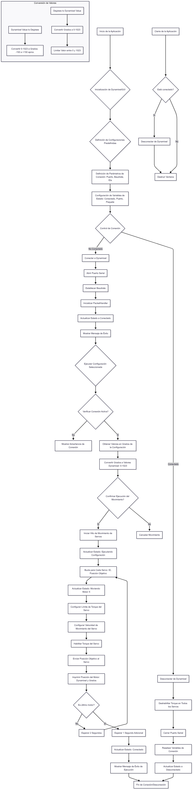

# Robotica 2025-1 Laboratorio 4
En este repositorio se subiran los documentos y codigos correspondientes a la practica de laboratorio 4.

El objetivo principal de esta practica es explorar y comprender la cinematica directa de un robot (Phantom X Pincher), a traves de su manipulacion y control. Para lograr esto, se implementan diversas funcionalidades que permiten interactuar con los servomotores Dynamixel AX-12  del robot. Esto incluye la creación y gestión de Joint Controllers en ROS , la manipulación de los tópicos de estado y comando , y la utilización de los servicios de ROS para controlar cada una de las articulaciones del manipulador (waist, shoulder, elbow, wrist).

## Archivos del repositorio
- [Carpeta src](Codigo/src): Encontramos todos los archivos fuente, donde se configura la comunicacion, parametros y demas caracteristicas de nuestro manipulador.
- [control_servo.py](Codigo/src/pincher_control/pincher_control/control_servo.py): código en python que crea la ventana de control y manipula dichos parametros.
- [setup.py](Codigo/src/pincher_control/setup.py): Codigo en python donde se manipula la comunicacion entre el codigo del controlador y el manipulador.
- [Carpeta build](Codigo/build): Carpeta donde se encuentran los archivos que permiten la compilacion del workspace de ROS 2.
- [Carpeta install](Codigo/install): En esta carpeta encontramos los codigos que configuran el entorno shell para usar paquetes que se acaban de compilar en "BUILD".
- [Images](Images): carpeta de archivos de imágen usada en README.md.
- README.md: este documento.

## Contenidos
- [Diagrama de flujo](#diagrama-de-flujo)
- []

## Diagrama de flujo
La siguiente imagen es respecto al diagrama de flujo del proceso realizado por el robot:

    

## Funciones y estructuras de programación utilizadas
En la programacion del control del robot, se han empleado las siguientes funciones y estructuras principales:
- Clase **DynamixelGUI**: Esta es la estructura principal que encapsula toda la logica de la interfaz de usuario y el control de los servomotores Dynamixel. Contiene metodos y atributos relacionados con la conexion, control y visualizacion.
    - **__init__(self, root)**: El constructor de la clase, utilizado para inicializar la aplicación, definir configuraciones predefinidas de poses, parámetros de conexión de los Dynamixel (puerto, baudrate, IDs), y variables de estado.
    - **setup_ui(self)**: Método encargado de la configuración de la interfaz de usuario (elementos de Tkinter), como etiquetas, botones y frames.
    - **get_script_directory(self)**: Una función auxiliar para obtener la ruta absoluta del directorio donde se ejecuta el script.
    - **find_ros2_workspace(self)**: Función para intentar localizar automáticamente el espacio de trabajo (workspace) de ROS 2, buscando directorios específicos o patrones comunes.
    -**create_configuration_buttons(self, parent)**: Se encarga de generar los botones en la interfaz para cada una de las configuraciones de poses predefinidas.
    - **dynamixel_value_to_degrees(self, dynamixel_value)**: Convierte un valor de posición crudo de un servomotor Dynamixel (rango 0-1023) a un valor en grados.
    - **degrees_to_dynamixel_value(self, degrees)**: Realiza la operación inversa, convirtiendo un valor en grados a un valor de posición para el servomotor Dynamixel, limitándolo al rango permitido (0-1023).
    - **toggle_connection(self)**: Función que alterna el estado de conexión con los servomotores, llamando a connect_to_dynamixel o disconnect_from_dynamixel según el estado actual.
    - **connect_to_dynamixel(self)**: Establece la comunicación con los servomotores Dynamixel a través del puerto serial especificado, configurando el baudrate y el PacketHandler.
    - **disconnect_from_dynamixel(self)**: Cierra la comunicación con los servomotores, deshabilitando el torque en todos ellos antes de cerrar el puerto.
    - **execute_configuration(self, config_name)**: Inicia el proceso de mover los servomotores a una configuración predefinida. Obtiene los valores en grados, los convierte a valores Dynamixel y confirma la ejecución con el usuario. El movimiento se realiza en un hilo separado para no bloquear la interfaz.
    - **move_servos(self, goal_positions, config_name)**: Esta es una función crítica que se ejecuta en un hilo separado (threading.Thread). Es responsable de enviar las posiciones objetivo a cada servomotor de forma secuencial, aplicando límites de torque y velocidad, y habilitando el torque antes de cada movimiento. Incluye una pausa de 2 segundos entre movimientos de articulaciones.
    - **on_closing(self)**: Manejador de eventos para cuando la ventana de la aplicación se está cerrando, asegurando una desconexión limpia de los servomotores.
- Control de Servomotores Dynamixel (a traves de **dynamixel_sdk**):
    - PortHandler: Gestiona la apertura y cierre del puerto de comunicación serial (ej. /dev/ttyUSB0) con los servomotoores.
    - PacketHandler: Maneja el envío y recepción de paquetes de datos a los servomotores Dynamixel.
    - write1ByteTxRx(port, ID, Address, Value): Escribe un byte de datos en una dirección de registro específica de un servomotor (ej. ADDR_TORQUE_ENABLE).
    - write2ByteTxRx(port, ID, Address, Value): Escribe dos bytes de datos en una dirección de registro específica de un servomotor (ej. ADDR_GOAL_POSITION, ADDR_MOVING_SPEED, ADDR_TORQUE_LIMIT).

## Imagenes de simulaciones

En la siguiente imagen vemos la ventana creada con ayuda de la libreria Tkinter, en la que se presentan las configuraciones deseadas para cada robot:

    

    

## Código en python
En [este](Codigo/src/pincher_control/pincher_control/control_servo.py) archivo se encuentra el código fuente utilizado para la creacion de la ventana y la configuracion de los motores y el movimiento de estos.

## Video: simulación e implementación
Se presenta la simulación e implementación correspondientes a lo descrito anteriormente en el siguiente enlace de YouTube:

[Video presentacion](https://youtu.be/jVQhF02vhfQ)